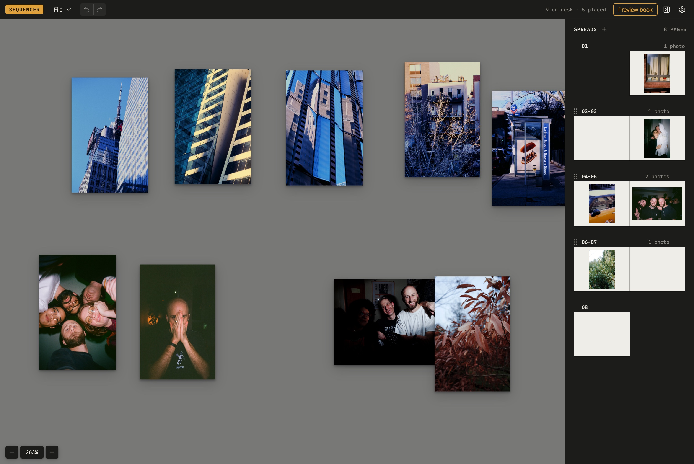

# Sequence

A tool for playing with photo sequences.

**Try it:** https://sequence.photos/app/ · [Privacy policy](https://sequence.photos/privacy/)



## Run locally

```bash
nvm use        # Node 24 (needs ≥ 20.19)
npm install
npm run dev    # → http://localhost:5173
```

The site has four pages: the landing page (`index.html`, at `/`), the app
(`app/index.html`, at `/app/`), the privacy policy (`privacy/index.html`), and support
(`support/index.html`).

## Test

```bash
npm test             # run once
npm run test:watch   # re-run on save
npm run test:app     # Mac app, end to end: open, Save, Save As, relaunch (needs Rust)
```

`test:app` builds a test version of the Mac app and runs it on fixture projects (its
window shows for a few seconds), then checks the saved files from outside the app. Its
storage is kept apart from the real app's and deleted afterwards.

## Build

```bash
npm run build  # → dist/
```

The site's domain is set in `.env` (`VITE_SITE_DOMAIN`); links to it and its pages use it.

Netlify runs `npm test && npm run build` for production, pull-request previews, and branch deploys (see `netlify.toml`).

## Shortcuts

| Action              | Mac     | Windows         |
| ------------------- | ------- | --------------- |
| Add photos          | ⌘I      | Ctrl+I          |
| Preview             | ⌘P      | Ctrl+P          |
| Settings            | ⌘,      | Ctrl+,          |
| Import project      | ⌘O      | Ctrl+O          |
| Export              | ⌘S      | Ctrl+S          |
| Save PDF            | ⇧⌘P     | Ctrl+Shift+P    |
| Show/hide spreads   | ⌘B      | Ctrl+B          |
| Copy / paste photos | ⌘C / ⌘V | Ctrl+C / Ctrl+V |
| Duplicate photos    | ⌘D      | Ctrl+D          |
| Quick Look          | Space   | Space           |
| Undo                | ⌘Z      | Ctrl+Z          |
| Redo                | ⇧⌘Z     | Ctrl+Y          |

Hold ⌘ / Ctrl to see them on screen.

Right-click the desk to tidy photos into a grid or change the desk color.

**Guides** (in the toolbar) sets up the guides photos snap to, on every spread and mirrored
on facing pages: center lines, border guides (a distance from each edge: top, bottom,
inside at the gutter, and outside), and straight guides you drag out of the rulers (hold
Shift to snap to ⅛ in; drag one off the page to remove it). Click any guide to highlight
its settings. Photos dropped on a page fit inside the border guide marked **On drop**.

File → Take the tour walks through the app with a few sample photos (it also runs on your first visit). Your own project is set aside while it runs and comes back when it ends.

## Mac app

The same app also builds as a native Mac app with [Tauri](https://tauri.app): a menu
bar, Save dialogs, and projects as documents. `.photo-sequence` files open in it with a
double-click, File → Save keeps the project in its file, and the window's title shows
when there are unsaved changes.

```bash
npm run app         # run it, reloading on changes (needs Rust: https://rustup.rs)
npm run build:app   # → src-tauri/target/release/bundle/macos/
```

The website and the app share all their code except what `src/platform/types.ts`
describes: each build imports `#platform`, which points at `src/platform/browser.ts` for
the website and `src/platform/macos/` for the app (see `vite.config.ts`). So the app's
code is never part of the website, and the website's other pages and `public/` files are
never part of the app (CI checks both). Anything added there has to be implemented for both.

### App Store

The app runs in the App Sandbox (`src-tauri/Entitlements.plist`), local builds too: it can
use the files you pick or double-click, and keeps bookmarks to them so a project can still
be saved after a restart.

```bash
npm run app:store   # → a signed, universal .pkg for App Store Connect (uploads it, given an API key)
```

It needs the Apple Distribution and Mac Installer Distribution certificates in your
keychain, and the app's Mac App Store provisioning profile at
`src-tauri/embedded.provisionprofile`; it says what's missing. The **App Store** workflow
does the same in CI, after the tests, when a GitHub release is published (tagged `v` +
`package.json`'s version) or when run by hand; its header lists the secrets it needs.

## Offline and install

The deployed app works offline once it has loaded: a service worker (scoped to `/app/`)
keeps a copy of the whole app, and your work stays in the browser. To use it like a desktop app,
install it from the browser (Chrome/Edge: install icon in the address bar; Safari:
File → Add to Dock). Installing also makes the browser less likely to clear stored
work; Settings → Storage shows whether it's protected. Export to keep a backup.

New versions download in the background; the app shows "A new version is available"
and switches when you reload.

## Project files

Export saves a `.photo-sequence` file (a ZIP inside) you can import anywhere:

```
photo-book-2026-09-26.photo-sequence
├── project.json   # layout + settings
├── images/        # your original files
└── thumbs/        # display copies
```

Drop a project on the desk to open it. Plain `.zip` files with the same contents work too.

## InDesign

File → Export for InDesign saves a ZIP with an `.idml` file and a `Links/` folder of
the placed photos. Unzip it and open the `.idml` in InDesign (or Affinity Publisher):
you get a facing-pages document at the book's size, the On drop border guide as
margins, the other guides as ruler guides, and each photo in a frame, linked to its
original. If InDesign reports missing links, relink them to the `Links` folder.
